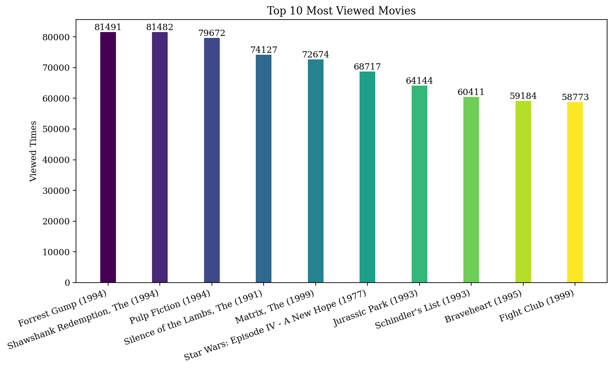
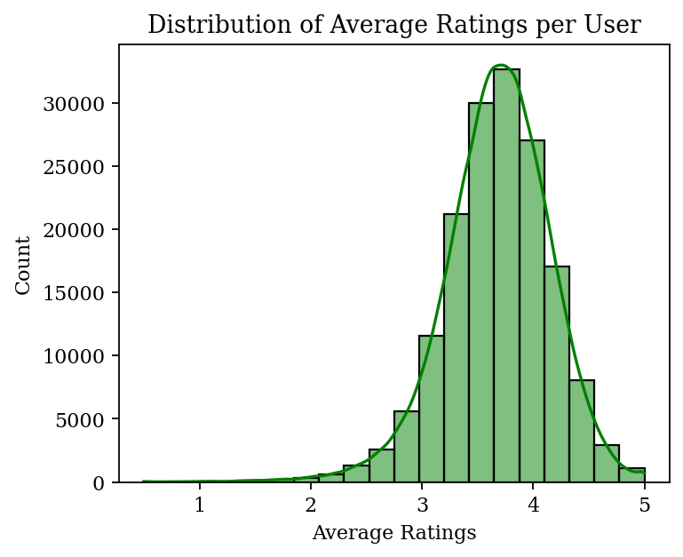
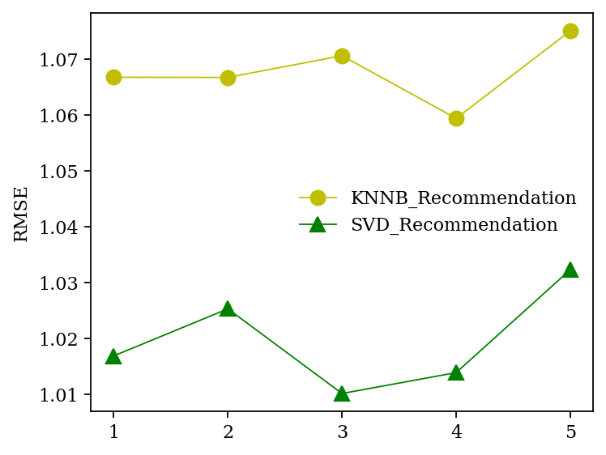

# MovieRecomSys_KNNB&SVD

## Project Overview
This project is a movie recommendation system that utilizes KNNB (K-Nearest Neighbors-Based) and SVD (Singular Value Decomposition) algorithms.
By analyzing user rating data, this system can generate personalized movie recommendations.

## Table of Contents
- [Data Visualization](#data-visualization)
- [Model Training and Evaluation](#model-training-and-evaluation)
- [Dataset Source](#dataset-source)
- [How to Use](#how-to-use)

## Data Visualization

### Most Viewed Movies Visualization
In this section, we visualize the most viewed movies.
By analyzing the viewing records in the dataset, we showcase user interest in different movies.


### Visualize the Distribution of Average Ratings per User
This visualization displays the distribution of average ratings per user, helping to understand user rating habits and preferences.

  <!-- Replace with the actual path to your visualization image -->

## Model Training and Evaluation

### KNNB - Generating Recommendations
We use the KNNB algorithm to generate recommendations for a specific user. Here are the top 10 recommended movies for user ID `99476`:

1. MovieID: 26524, MovieTitle: Times of Harvey Milk, The (1984)
2. MovieID: 1259, MovieTitle: Stand by Me (1986)
3. MovieID: 2475, MovieTitle: 52 Pick-Up (1986)
4. MovieID: 318, MovieTitle: Shawshank Redemption, The (1994)
5. MovieID: 68319, MovieTitle: X-Men Origins: Wolverine (2009)
6. MovieID: 8810, MovieTitle: AVP: Alien vs. Predator (2004)
7. MovieID: 1041, MovieTitle: Secrets & Lies (1996)
8. MovieID: 2527, MovieTitle: Westworld (1973)
9. MovieID: 4369, MovieTitle: Fast and the Furious, The (2001)
10. MovieID: 4995, MovieTitle: Beautiful Mind, A (2001)

### SVD
The SVD algorithm is employed to enhance the accuracy and personalization of the recommendations.

### Evaluation Metrics
We evaluate the models using the following metrics:
- RMSE (Root Mean Square Error)
- MAE (Mean Absolute Error)

The visualization of the evaluation results is as follows:

  <!-- Replace with the actual path to your evaluation image -->

## Dataset Source
The datasets used in this project are sourced from Kaggle, containing movie information and user ratings. You can download the datasets from the following link:
- [Movie Recommendation System Dataset](https://www.kaggle.com/datasets/parasharmanas/movie-recommendation-system/data)

The dataset includes two files:
- `movies.csv`: Contains movie information.
- `ratings.csv`: Contains user rating information.

## How to Use
1. Clone this repository:
   ```bash
   git clone https://github.com/Edie-Z/MovieRecomSys_KNNB-SVD.git
